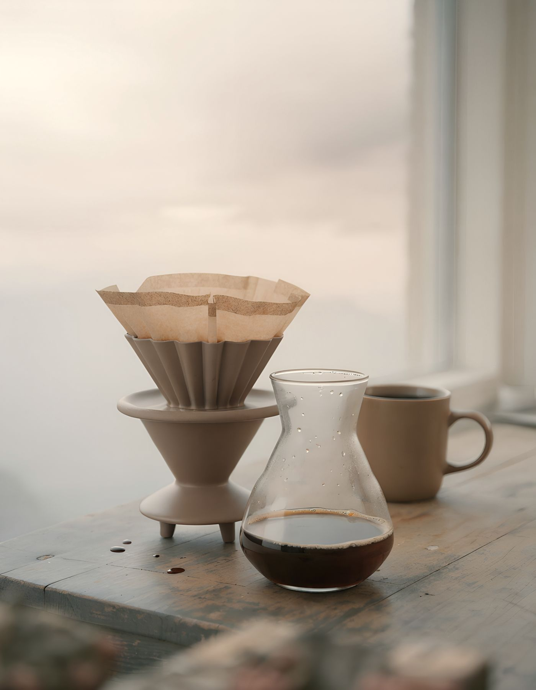

# Roastline · Coffee that learns your taste

Specialty coffee subscription that adapts to every rating. UI/UX case study by **Tania Aisen**, UI/UX & Product Designer.

**Live site:** https://tanyaaisen07-uiux.github.io/roastline/
**Figma (design system + prototype):** https://www.figma.com/design/vTIFRXBgfBX3eqYYO0cDC7

## What's inside
- **Landing:** hero, taste profile sliders with live match, "The Loop" experience, plans with delivery frequency, origin story, FAQ
- **Taste quiz:** 3 steps → personal match → recommended plan
- **Product page (Ethiopia Guji):** subscription vs one-time, bag size, grind, quantity, sticky buy bar
- **Checkout** with validation and order confirmation
- **My Roastline:** next delivery, rate / swap / skip, subscription settings

## Design
- Palette: cream #F6F2EC, espresso #22180F, terracotta #8A4F26, sand #E9DCC9
- Type: Hanken Grotesk, Instrument Sans, JetBrains Mono
- Calm, editorial motion: reveal on scroll, animated line, crossfades, live price tween

## Role
Product thinking, UX flows, UI design, design system in Figma, front-end build.

Self-initiated project · 2026
